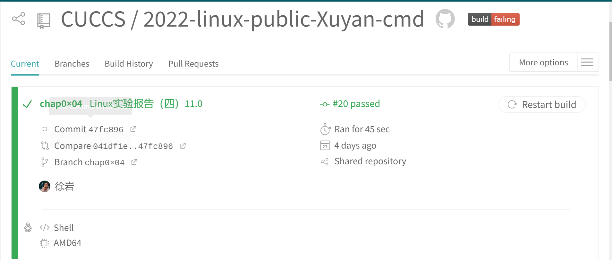

# Linux网络与系统管理实验（四）shell脚本编程基础

------

## 实验环境

- **VirtualBox 6.1**
- **Ubuntu 20.04.02 Server 64bit**
- **Travis CI**
- **VsCode（已安装相应环境依赖）**

## 实验内容

### 任务一：用bash编写一个图片批处理脚本，实现以下功能：

- ☑️支持命令行参数方式使用不同功能

- ☑️支持对指定目录下所有支持格式的图片文件进行批处理指定目录进行批处理

- ☑️支持以下常见图片批处理功能的单独使用或组合使用

  - ☑️支持对jpeg格式图片进行图片质量压缩
  - ☑️支持对jpeg/png/svg格式图片在保持原始宽高比的前提下压缩分辨率
  - ☑️支持对图片批量添加自定义文本水印
  - ☑️支持批量重命名（统一添加文件名前缀或后缀，不影响原始文件扩展名）
  - ☑️支持将png/svg图片统一转换为jpg格式

### 任务二：用bash编写一个文本批处理脚本，对以下附件分别进行批量处理完成相应的数据统计任务：

- ☑️统计不同年龄区间范围（20岁以下、[20-30]、30岁以上）的球员数量、百分比
- ☑️统计不同场上位置的球员数量、百分比
- ☑️名字最长的球员是谁？名字最短的球员是谁？
- ☑️年龄最大的球员是谁？年龄最小的球员是谁？

### 任务三：用bash编写一个文本批处理脚本，对以下附件分别进行批量处理完成相应的数据统计任务：

- ☑️统计访问来源主机TOP 100和分别对应出现的总次数
- ☑️统计访问来源主机TOP 100 IP和分别对应出现的总次数
- ☑️统计最频繁被访问的URL TOP 100
- ☑️统计不同响应状态码的出现次数和对应百分比
- ☑️分别统计不同4XX状态码对应的TOP 10 URL和对应出现的总次数
- ☑️给定URL输出TOP 100访问来源主机

## 实验要求

- 所有源代码文件必须单独提交并提供详细的`-help`脚本内置帮助信息
- 任务三的所有统计数据结果要求写入独立实验报告

## 操作过程

#### **以下代码执行情况可查看**[我的Travis CI](https://app.travis-ci.com/github/CUCCS/2022-linux-public-Xuyan-cmd)



### **任务一   批量处理图像**  [[task01.sh]](codefile/task1.sh)

- 安装`imagemagick`和`shellcheck`，并用远程从本地上传需要的图片文件。

  ```shell
  sudo apt-get update
  sudo apt-get install -y shellcheck
  sudo apt-get install imagemagick
  ```


- 编写任务一脚本[[task01.sh]](codefile/task1.sh)

- 支持通过命令行参数方式使用不同功能，命令行的参数可以决定使用的功能。内置help函数帮助理解脚本功能。编写help函数解释命令行参数功能

  ```shell
  function help {
      echo "doc"
      echo "-q Q               对jpeg格式图片进行图片质量因子为Q的压缩"
      echo "-r R               对jpeg/png/svg格式图片在保持原始宽高比的前提下压缩成R分辨率"
      echo "-w font_size text  对图片批量添加自定义文本水印"
      echo "-p text            统一添加文件名前缀，不影响原始文件扩展名"
      echo "-s text            统一添加文件名后缀，不影响原始文件扩展名"
      echo "-t                 将png/svg图片统一转换为jpg格式图片"
      echo "-h                 帮助文档"
  }
  while [ "$1" != "" ];do
  case "$1" in
      "-q")
          compressQuality "$2"
          exit 0
          ;;
      "-r")
          compressResolution "$2"
          exit 0
          ;;
      "-w")
          watermark "$2" "$3"
          exit 0
          ;;
      "-p")
          prefix "$2"
          exit 0
          ;;
      "-s")
          suffix "$2"
          exit 0
          ;;
      "-t")
          transform2Jpg
          exit 0
          ;;
      "-h")
          help
          exit 0
          ;;
  esac
  done
  ```

- 编写函数对jpeg格式图片进行图片质量压缩

- ```shell
  # 对jpeg格式图片进行图片质量压缩
  # convert filename1 -quality 50 filename2
  function compressQuality {
      Q=$1 # 质量因子
      for i in *;do
          type=${i##*.} # 删除最后一个.及左边全部字符
          if [[ ${type} != "jpeg" ]]; then continue; fi;
          convert "${i}" -quality "${Q}" "${i}"
          echo "${i} is compressed."
      done
  }
  ```

- 对jpeg/png/svg格式图片在保持原始宽高比的前提下压缩分辨率

- ```shell
  # 对jpeg/png/svg格式图片在保持原始宽高比的前提下压缩分辨率
  # convert filename1 -resize 50% filename2
  function compressResolution {
      R=$1
      for i in *;do
          type=${i##*.}
          if [[ ${type} != "jpeg" && ${type} != "png" && ${type} != "svg" ]]; then continue; fi;
          convert "${i}" -resize "${R}" "${i}"
          echo "${i} is resized."
      done
  }
  ```

- 对图片批量添加自定义文本水印

- ```shell
  # 对图片批量添加自定义文本水印
  # convert filename1 -pointsize 50 -fill black -gravity center -draw "text 10,10 'Works like magick' " filename2
  function watermark {
      for i in *;do
          type=${i##*.}
          if [[ ${type} != "jpeg" && ${type} != "png" && ${type} != "svg" ]]; then continue; fi;
          convert "${i}" -pointsize "$1" -fill black -gravity center -draw "text 10,10 '$2'" "${i}"
          echo "${i} is watermarked with $2."
      done
  }
  ```

- 批量重命名（统一添加文件名前缀或后缀，不影响原始文件扩展名）

- ```shell
  # 批量重命名（统一添加文件名前缀或后缀，不影响原始文件扩展名）
  # mv filename1 filename2
  function prefix {
      for i in *;do
          type=${i##*.}
          if [[ ${type} != "jpeg" && ${type} != "png" && ${type} != "svg" ]]; then continue; fi;
          mv "${i}" "$1""${i}"
          echo "${i} is renamed to $1${i}"
      done
  }
  function suffix {
      for i in *;do
          type=${i##*.}
          if [[ ${type} != "jpeg" && ${type} != "png" && ${type} != "svg" ]]; then continue; fi;
          filename=${i%.*}$1"."${type}
          mv "${i}" "${filename}"
          echo "${i} is renamed to ${filename}"
      done
  }
  ```

  **测试结果**：


### **任务二 世界杯运动员数据统计** [[查看实验结果报告]](task02_lab_report.md)

- 将所需文件下载到本地。

- ```shell
  wget "https://c4pr1c3.gitee.io/linuxsysadmin/exp/chap0x04/worldcupplayerinfo.tsv"
  ```

- 编写脚本[[task02.sh]](codefile/task2.sh)

- 编写help函数解释命令行参数功能，与任务一的内置Help函数编写一致

- ```shell
  function help {
      echo "doc"
      echo "-s                 统计不同年龄区间范围（20岁以下、[20-30]、30岁以上）的球员数量、百分比"
      echo "-p                 统计不同场上位置的球员数量、百分比"
      echo "-n                 名字最长的球员是谁？名字最短的球员是谁？"
      echo "-a                 年龄最大的球员是谁？年龄最小的球员是谁？"
      echo "-h                 帮助文档"
  }
  ```

- 年龄统计中，对每行字段进行拆分和提取，并且依次比较大小进行排序

- ```shell
  # 统计不同年龄区间范围（20岁以下、[20-30]、30岁以上）的球员数量、百分比
  function countAge {
      awk -F "\t" '
          BEGIN {a=0; b=0; c=0;}
          $6!="Age" {
              if($6>=0&&$6<20) {a++;}
              else if($6<=30) {b++;}
              else {c++;}
          }
          END {
              sum=a+b+c;
              printf("Age\tCount\tPercentage\n");
              printf("<20\t%d\t%f%%\n",a,a*100.0/sum);
              printf("[20,30]\t%d\t%f%%\n",b,b*100.0/sum);
              printf(">30\t%d\t%f%%\n",c,c*100.0/sum);
          }' worldcupplayerinfo.tsv
  }
  ```

- 运动员位置提取，依旧采用分段提取，并且进行类别组合

- ```shell
  # 统计不同场上位置的球员数量、百分比
  function countPosition {
      awk -F "\t" '
          BEGIN {sum=0}
          $5!="Position" {
              pos[$5]++;
              sum++;
          }
          END {
              printf("    Position\tCount\tPercentage\n");
              for(i in pos) {
                  printf("%13s\t%d\t%f%%\n",i,pos[i],pos[i]*100.0/sum);
              }
          }' worldcupplayerinfo.tsv
  }
  ```

- 获取到运动员的名字和对应年龄段，并且依次将年龄进行比较排序，存下年龄最大值和最小值以及对应的名字。

- ```shell
  # 年龄最大的球员是谁？年龄最小的球员是谁？
  # 考虑并列
  function maxAge {
      awk -F "\t" '
          BEGIN {mx=-1; mi=1000;}
          NR>1 {
              age=$6;
              names[$9]=age;
              mx=age>mx?age:mx;
              mi=age<mi?age:mi;
          }
          END {
              printf("The oldest age is %d, who is\n", mx);
              for(i in names) {
                  if(names[i]==mx) { printf("%s\n", i); }
              }
              printf("The youngest age is %d, who is\n", mi);
              for(i in names) {
                  if(names[i]==mi) { printf("%s\n", i); }
              }
          }' worldcupplayerinfo.tsv
  }
  ```

- 姓名长度，这里姓名长度的比较是以**字符个数**为标准。提取姓名片段后，先对字符串进行预处理，在使用`${#STRING}`的方式取得长度，进行比较得到最大值和最小值。同时对于运动员中的一些特殊字符进行处理和识别

- ```shell
  # 名字最长的球员是谁？名字最短的球员是谁？
  # 考虑并列
  function maxName {
      awk -F "\t" '
          BEGIN {mx=-1; mi=1000;}
          $9!="Player" {
              len=length($9);
              names[$9]=len;
              mx=len>mx?len:mx;
              mi=len<mi?len:mi;
          }
          END {
              for(i in names) {
                  if(names[i]==mx) {
                      printf("The longest name is %s\n", i);
                  } else  if(names[i]==mi) {
                      printf("The shortest name is %s\n", i);
                  }
              }
          }' worldcupplayerinfo.tsv
  }
  ```

- 测试脚本结果

  

### **任务三处理主机访问数据** [[查看实验结果报告]](task03_lab_report.md)

- 提前安装`p7zip-full`

  ```shell
  sudo apt-get install p7zip-full
  ```

- 将所需文件下载到本地并解压

  ```shell
  wget "https://c4pr1c3.gitee.io/linuxsysadmin/exp/chap0x04/worldcupplayerinfo.tsv"
  7z x web_log.tsv.7z
  ```

​		

- 编写脚本和相关内容[[task03.sh]](codefile/task3.sh)

- 通过函数遍历所有访问数据，并且进行存储。

- ```shell
  # 统计访问来源主机TOP 100和分别对应出现的总次数
  function top100_host {
      printf "%40s\t%s\n" "TOP100_host" "count"
      awk -F "\t" '
      NR>1 {host[$1]++;}
      END { for(i in host) {printf("%40s\t%d\n",i,host[i]);} }
      ' web_log.tsv | sort -g -k 2 -r | head -100
  }
  ```

- 对于含有重复出现的IP地址数据，编写函数进行提取比较，并且在计数时进行不重复统计

- ```shell
  # 分别统计不同4XX状态码对应的TOP 10 URL和对应出现的总次数
  function stateCode4 {
      printf "%55s\t%s\n" "code=403 URL" "count"
      awk -F "\t" '
      NR>1 { if($6=="403") code[$5]++;}
      END { for(i in code) {printf("%55s\t%d\n",i,code[i]);} }
      ' web_log.tsv | sort -g -k 2 -r | head -10
  
      printf "%55s\t%s\n" "code=404 URL" "count"
      awk -F "\t" '
      NR>1 { if($6=="404") code[$5]++;}
      END { for(i in code) {printf("%55s\t%d\n",i,code[i]);;} }
      ' web_log.tsv | sort -g -k 2 -r | head -10
  }
  ```

- 测试脚本结果,将收集到的数据整成txt文件保存下来

  

  

## 过程中遇到的问题

- 在作业仓库中部署Travis CI时编写的.travis.yml文件无法被识别和读取，Travis不能记录到我的相关代码活动

  **解决方法**：将.travis.yml文件放在当前分支下的根目录里面即可被Travis识别和执行。

- 在.travis.yml文件的编写中，根据我的文件目录结构cd进“chap0×04”，因为我的脚本在codefile/文件夹，所以我再要cd codefile/去运行我的脚本，但是我在这个yml文件编写过程中始终不能成功执行。

  **解决方法**：由于Travis CI不能识别“×”，因此不能够识别到我的作业文件夹，故通过git bash删除原文件夹重新命名，因为git bash不能区分乘号和小写拉丁字母x，所以用git rf的改名方法在此处没有效果。

- 在统计2014年世界杯运动员的相关姓名时，一些人名带有特殊符号，此时bash语法不清楚如何去读写识别、

  **解决方法**：通过shll的通配符去完成识别

- 任务二中，统计位置实验结果中 `Défenseur` 应为法语守门员写法，理论上应该归入`Defender` 。源数据问题未作调整。

- 任务一中，加水印本地正常运行，travis运行报错 `convert:unable to read font (null)`

  **解决方法**：有些系统没有默认安装字体库，搜集资料后增加安装 `ghostscript`。

- 在对svg进行分辨率压缩和水印处理后，格式内容发生变化，之后无法进行其他操作,也无法正常打开。

  **解决方法**：imageMagick无法对svg格式图片正常操作。此处采用使用svgo来进行svg图片的处理操作

- 在编写脚本时，当使用数组作为函数参数时，发现只能传递数组的第一个元素，数组后面的元素不能传递到函数内。

  **解决方法**：使用regions作为参数传递，只会传递第一个元素。因此需要把参数写成 `${regions[*]}`才可以作为数组传递。

## 参考资料

- [2021Linux系统与网络管理](https://www.bilibili.com/video/BV1Hb4y1R7FE?p=67)
- [shell脚本编程基础](https://c4pr1c3.github.io/LinuxSysAdmin/chap0x04.md.html#/title-slide)
- [How the bash shell recognizes special symbols](https://blog.csdn.net/woshaguayi/article/details/89365142)
- [Travis CI official documentation](https://docs.travis-ci.com/user/tutorial/?utm_source=help-page&utm_medium=travisweb)
- [How to delete specified files and directories in git](https://blog.csdn.net/shuilan0066/article/details/70568595)
- [How to use weget](https://www.jb51.net/LINUXjishu/86326.html)
- [CUCCS/Linux-2020-LyuLumos](https://github.com/CUCCS/linux-2020-LyuLumos)
- [Linux command--find and statistics (grep, awk, sort, uniq, wc)](https://blog.csdn.net/hshuihui/article/details/77915398)
- [Summary of shell interception string methods in linux](https://blog.51cto.com/u_13865122/2727802)
- [.TSV file extension meaning](https://www.reviversoft.com/zh-cn/file-extensions/tsv)
- [shell多进程处理多图像](https://blog.csdn.net/weixin_40805392/article/details/104792874)
- [Shell Tutorial](https://www.runoob.com/linux/linux-shell.html)
- [Extraction method of file suffix, directory, etc. in shell](https://blog.csdn.net/binggan_2019/article/details/89024460?ops_request_misc=&request_id=&biz_id=102&utm_medium=distribute.pc_search_result.none-task-blog-2~all~sobaiduweb~default-6)
- [SVG图片脚本处理工具](https://blog.51cto.com/u_15127519/4620660)


