# 第一章：Linux基础-实验

------

## 实验软件环境

------

- **VirtualBox 6.1**
- **Ubuntu 20.04.02 Server 64bit**
- **阿里云平台**

## 实验问题

------

- #### 调查并记录实验环境的如下信息：

  - ###### 当前 Linux 发行版基本信息

  - ###### 当前 Linux 内核版本信息

- #### Virtualbox 安装完 Ubuntu 之后新添加的网卡如何实现系统开机自动启用和自动获取 IP？

- #### 如何使用 `scp` 在「虚拟机和宿主机之间」、「本机和远程 Linux 系统之间」传输文件？

- #### 如何配置 SSH 免密登录？

------

## 一、调查并记录实验环境

------

**查询当前 Linux 发行版基本信息**

- **操作过程**
  - 方法一：通过LSB（Linux标准库）能够打印发行版的具体信息，包括发行版名称、版本号、代号等

操作代码：

```shell
lsb_release -a
```

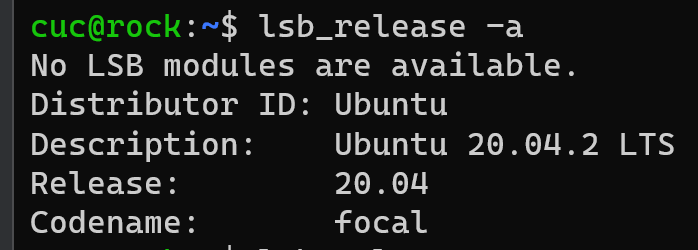

​				可以得到当前Ubuntu的发行版本代号为：20.04

- 方法二：release 文件通常被视为操作系统的标识。在 `/etc` 目录下放置了很多记录着发行版各种信息的文件，每个发行版都各自有一套这样记录着相关信息的文件。

  - 操作代码：

    ```shell
    cat /etc/issue
    cat /etc/issue.net
    cat /etc/lsb-release
    cat /etc/os-release
    ```

    - 两种方法均可查询到当前Linux的发行版本相关信息，包括发行版名称、版本号、代号等。

    

- **查询当前 Linux 内核版本信息**

​	**操作过程**		

- uname（unix name 的意思） 是一个打印系统信息的工具，包括内核名称、版本号、系统详细信息以及所运行的操作系统等等。

操作代码：

```shell
uname -a
```


可知当前所用Ubuntu20.04的内核版本为：5.4.0-65-generic

------

## 二、Virtualbox 安装完 Ubuntu 之后新添加的网卡如何实现系统开机自动启用和自动获取 IP？

------

### 具体过程

**网络配置**

**在 `NAT` 的基础上再开启另一块网卡 `Host-Only` ，使用 `netplan` 配置。**

- 第一步，查询当前网卡使用情况

  - ```shell
    ip a
    ```

    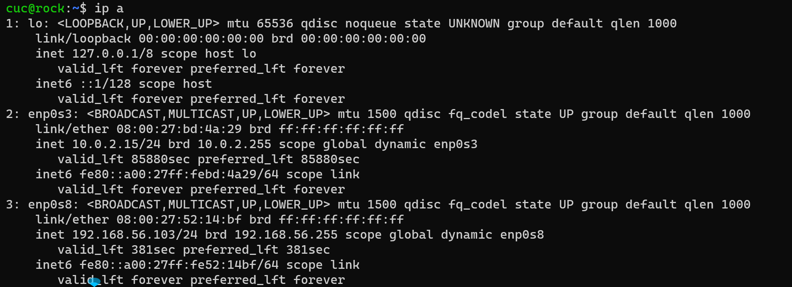

- ​	第二步，修改配置文件并应用

  - ```shell
    sudo vim /etc/netplan/01-netcfg.yaml
    sudo netplan apply
    ```

    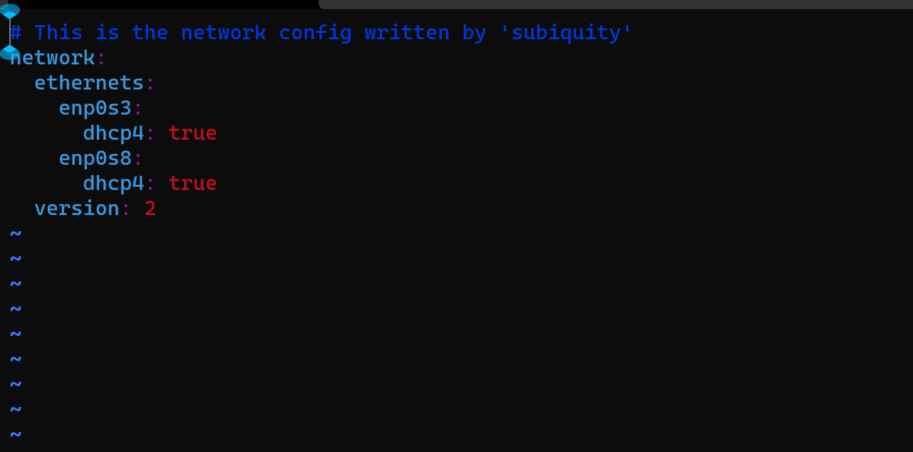

-   第三步，再次查询网卡状态，并获取ip

  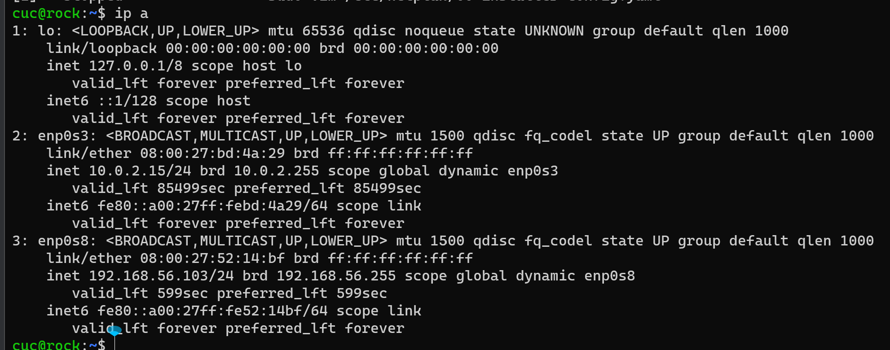

------

## 三、如何使用 `scp` 在「虚拟机和宿主机之间」、「本机和远程 Linux 系统之间」传输文件？

------

### 具体过程

- **使用 `scp` 在「虚拟机和宿主机之间」传输文件：**

  - 查阅相关资料：Linux scp 命令用于 Linux 之间复制文件和目录。scp 是 secure copy 的缩写, scp 是 linux 系统下基于 ssh 登陆进行安全的远程文件拷贝命令。

  - 通过查询scp语法可知相关语法

    ```shell
    scp [-1246BCpqrv] [-c cipher] [-F ssh_config] [-i identity_file]
    [-l limit] [-o ssh_option] [-P port] [-S program]
    [[user@]host1:]file1 [...] [[user@]host2:]file2
    ```

  - 使用Windows自带的scp功能与虚拟机相连，将测试文件`test.txt`复制到虚拟机

    - ​	

      ```shell
      scp C:/Users/86150/Desktop/test.txt cuc@192.168.56.103:remote_folder
      ```

      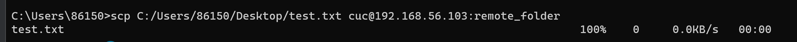

      `1 file（s）copied`表示文件已经拷贝到虚拟机当中，左下角也能看到传输数据信息。

- **使用scp实现「本机和远程 Linux 系统之间」传输文件：**

  - 首先登录阿里云平台，使用Linux指令入门-文件与权限的云服务场景，输入`ip a`可查看弹性ip地址

    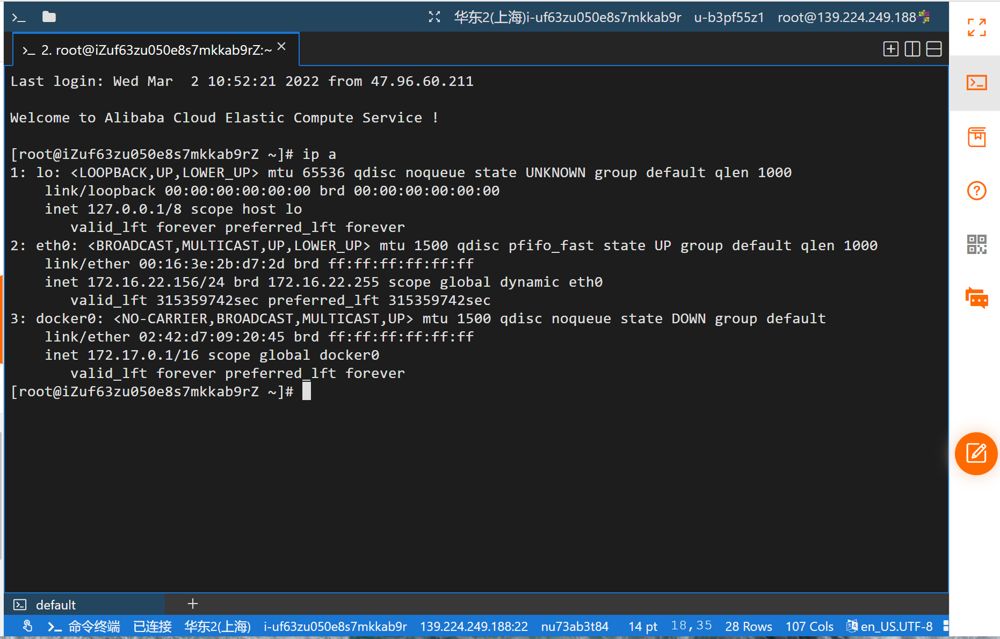

  - 与本地上传到虚拟机的语法相同，用scp语句将测试文件`test.txt`上传到阿里云的Linux虚拟系统

  ```shell
  scp C:/Users/86150/Desktop/test.txt root@139.224.249.188:remote_folder
  ```

  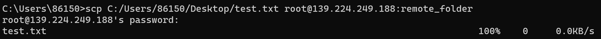

  - 输入密码后，可以看到测试文件已经上传成功


------

## 四、如何配置 SSH 免密登录？

------

### 具体过程

- **gitbash上进行的操作**

  - ```shell
    ssh-keygen -t rsa
    # 提示输入东西的时候，连续按3次enter 就好，在~/.ssh目录 下生成了id_rsa 和id_rsa.pub两个文件，后者上传至目标服务器
    ssh-copy-id  server_user@ipAddr
    # server_user是服务器用户名，ipAddr是IP地址
    ```

    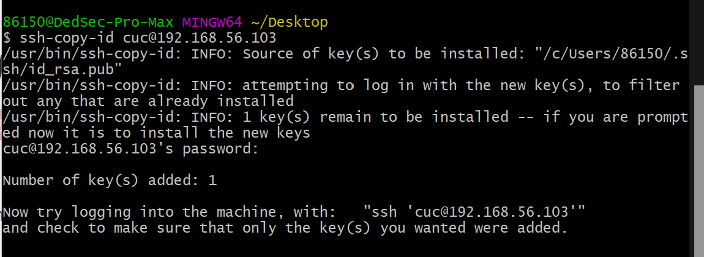

- **在虚拟机上进行的操作**

  - ```shell
    # 找到 /etc/ssh/sshd_config 这个文件
    vim /etc/ssh/sshd_config
    # 并查询以下信息的状态：
    #	RSAAuthentication yes
    #	PubkeyAuthentication yes
    #	AuthorizedKeysFile .ssh/authorized_keys
    # 第2个可能找不到，没关系
    sudo service ssh restart
    ```

    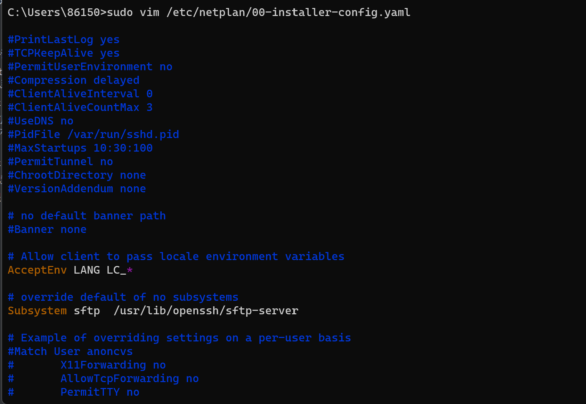

- **在linux中输入`cat ~/.ssh/authorized_keys`，即可查看公钥内容**

  - ```shell
    cat ~/.ssh/authorized_keys
    ```

    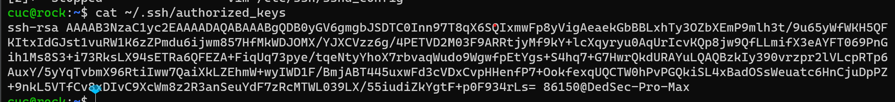

- **接下来，在cmd中输入`ssh username@remote`，即可免密登录虚拟机的Linux系统**

  - ```shell
    ssh username@remote
    # username为用户名，remote为虚拟机的IP地址
    ```

    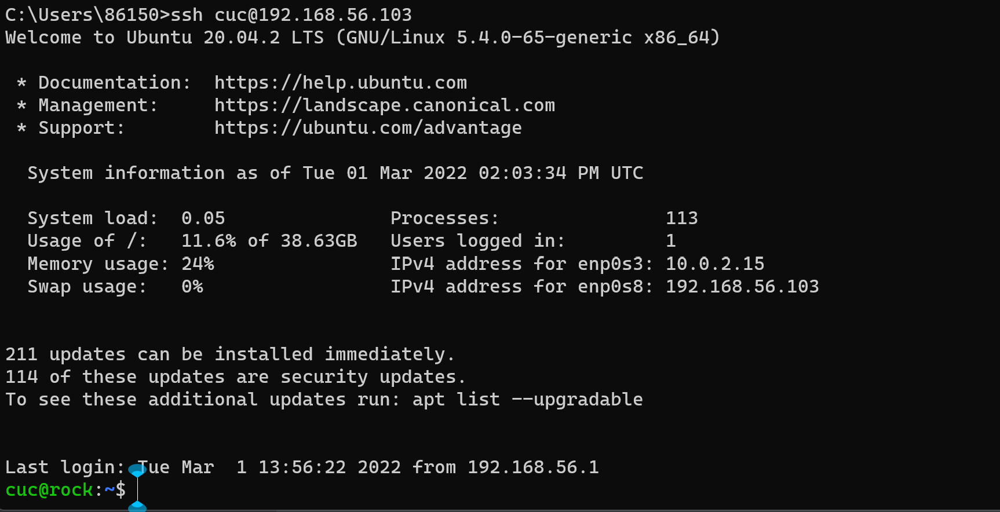

- **在cmd中通过修改配置来实现别名登录**

  - 1、在cmd中输入cd .ssh，进入.ssh文件夹，此时cmd中显示路径为C:\Users\你的机器名文件夹\.ssh
    2、输入cd .>config，在.ssh中创建host配置文件config
    3、在config中输入配置信息

    Host 自定义名称（建议用服务器名）

    HostName 服务器ip地址

    User 服务器名

    Port 22

    ```shell
    C:\Users\你的设备名称\.ssh>echo Host cuc >> config
    C:\Users\你的设备名称\.ssh>echo HostName 192.168.56.103 >> config
    C:\Users\你的设备名称\.ssh>echo User cuc >> config
    C:\Users\你的设备名称\.ssh>echo Port 22 >> config
    
    C:\Users\你的设备名称\.ssh>type config
    #	通过 type config可查看你修改后的配置信息
    ```

- 接下来，就可以直接`ssh 你的名称`就能实现最快捷的免密登录。

​	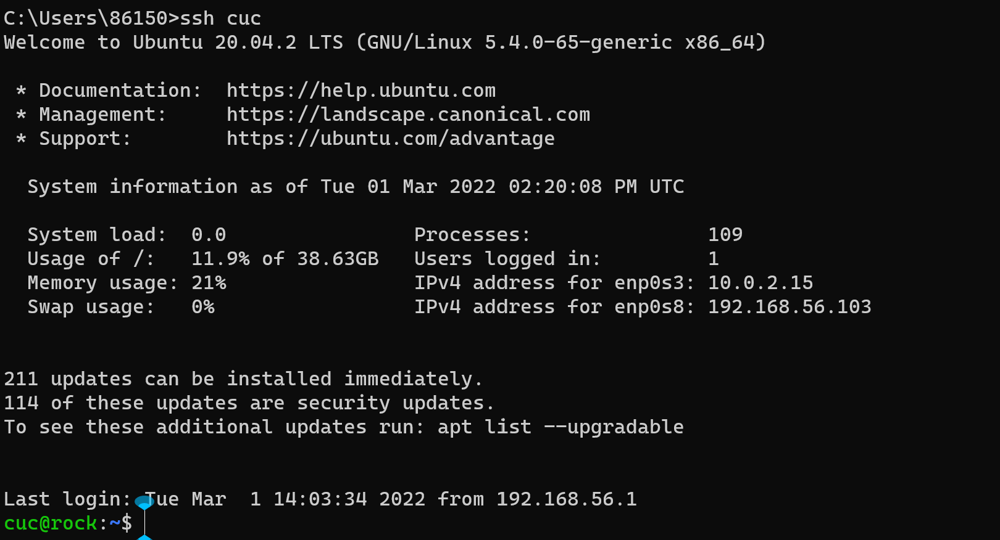

------

## 过程中遇到的问题

------

- 上传图片到Github上无法在md文件中渲染。

  将图片的引用地址改为相对地址。

- 对于如何进行分支操作和提交作业流程存在问题。

  直接通过git操作创建分支并转入当前分支，在此感谢黄玮老师的指导视频和我的师姐王卓岚的指导。

- 在使用scp语句进行文件传输过程中出现障碍。

  参考scp官方的相关语法，并且配置好宿主机的链接配置。

- 对于Linux发行版本和内核版本的概念出现混淆。

  通过查阅官方文档，了解了各个发行版本的版本号和对应内核版本信息。

- 网卡配置过程中，增加了NAT网络后，无法进行开机自启动调用。

  通过根据黄玮老师的课程视频资料，在~/etc/netplan/01-netcfg.yaml路径下修改配置文件。

- 在配置SSH免密登录过程中，不知如何查询/etc/ssh/sshd_config 文件位置并修改。

  通过vim的方式直接访问该文件的位置，并可以获得直接修改的权限。

- 在实现SSH别名登录过程中，在cmd中不知道如何配置HOST文件。

  ​	第一种，用记事本的方式打开config，输入以上配置信息保存。

  ​	第二种，在cmd中输入echo Host 自定义名称 >> config，然后重复上述命令，修改其中的内容，输入剩余的			HostName、User、Port。在cmd中输入type config，看是否输入成功。

  

------

## 参考资料

------

[View Linux version information](https://linux.cn/article-9586-1.html )

[Summary of methods for viewing system version information in Ubuntu](https://linux.cn/article-9586-1.html)

[Correspondence between kernel version and distribution version (CentOS &amp; Ubuntu)](https://blog.csdn.net/zhaihaibo168/article/details/102673669)

[After ubuntu20 adds a new network card, set it to automatically enable and get ip](https://blog.csdn.net/xiongyangg/article/details/110206220)

[Linux 系统与网络管理(2021)](https://www.bilibili.com/video/BV1Hb4y1R7FE?p=23)

[Windows + GitBash realizes password-free remote login to Ubuntu](https://blog.csdn.net/qq_42123832/article/details/113712378)

[How to use SSH to connect to Linux servers in Windows, as well as set up password-free login and configure aliases](https://blog.csdn.net/weixin_42633385/article/details/88785250 )

[The Linux Kernel Archives](https://blog.csdn.net/weixin_42633385/article/details/88785250)

[File transfer between Windows and Linux using scp command](https://www.1024sou.com/article/29558.html)

