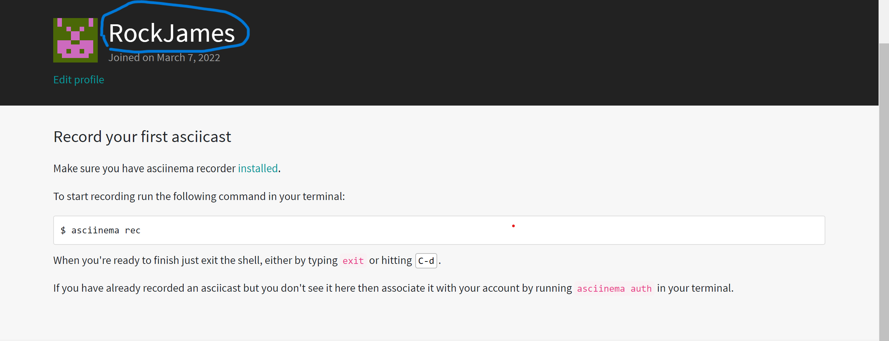
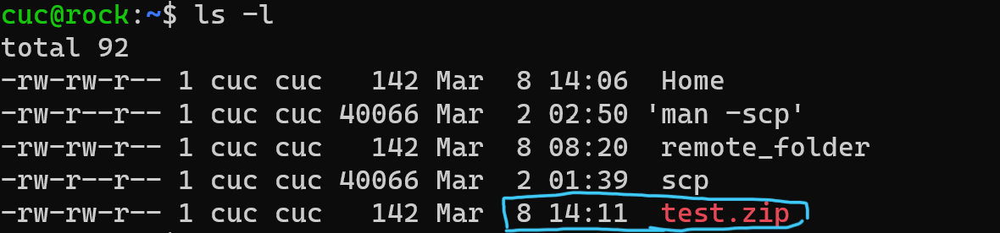

# Linux网络与系统管理实验（二）From GUI to CLI

## 实验软件环境

- **VirtualBox 6.1**
- **Ubuntu 20.04.02 Server 64bit**
- **阿里云平台（CentOS7.7）**
- **在 [asciinema](https://asciinema.org/) 注册一个账号，并在本地安装配置好asciinema**

## 实验要求

- **使用表格方式记录至少 2 个不同 Linux 发行版本上以下信息的获取方法，使用 [asciinema](https://asciinema.org/) 录屏方式「分段」记录相关信息的获取过程和结果**。

- **【软件包管理】在目标发行版上安装 `tmux` 和 `tshark` ；查看这 2 个软件被安装到哪些路径；卸载 `tshark` ；验证 `tshark` 卸载结果**。

- **【文件管理】复制以下**

  ```shell
  cd /tmp && for i in $(seq 0 1024);do dir="test-$RANDOM";mkdir "$dir";echo "$RANDOM" > "$dir/$dir-$RANDOM";done
  ```

  **代码到终端运行，在目标 Linux 发行版系统中构造测试数据集，然后回答以下问题：**

  - 找到 `/tmp` 目录及其所有子目录下，文件名包含 `666` 的所有文件
  - 找到 `/tmp` 目录及其所有子目录下，文件内容包含 `666` 的所有文件

- **【文件压缩与解压缩】练习课件中 [文件压缩与解压缩](https://c4pr1c3.github.io/LinuxSysAdmin/chap0x02.md.html#/12/1) 一节所有提到的压缩与解压缩命令的使用方法**

  **【跟练】 [子进程管理实验](https://asciinema.org/a/f3ux5ogwbxwo2q0wxxd0hmn54)**

  **【硬件信息获取】目标系统的 CPU、内存大小、硬盘数量与硬盘容量**

------

## 配置asciinema

按照官网doc操作

```shell
sudo apt-add-repository ppa:zanchey/asciinema
sudo apt install asciinema
asciinema auth
```



### **一、【软件包管理】在目标发行版上安装 `tmux` 和 `tshark` ；查看这 2 个软件被安装到哪些路径；卸载 `tshark` ；验证 `tshark` 卸载结果**。

##### 	操作过程：

- ​	**在Ubuntu20.04上的实现**：

  1、tmux的安装和查看安装路径

```shell
sudo apt install tmux #安装tmux
sudo apt-cache show tmux #查看安装包tmux当前安装路径
```

[](https://asciinema.org/a/VHMfCmoyIZZL5IrQpQgseM9KU)

- 2、tshark的安装、卸载和查看情况

  ```shell
  sudo apt-get install tshark #安装tshark
  sudo apt-cache show tshark	#查看当前安装路径
  sudo apt-get remove --purge tshark # 卸载tshark软件包
  ```

  [](https://asciinema.org/a/YMAInioW2Y5yIMgvQbjOIRgAR)

- **在阿里云平台（CentOS7.7）实现**：

​		1、tmux的安装和查看安装路径：	

```shell
yum install tmux #安装
rpm -qal |grep tmux #查看路径
```

[](https://asciinema.org/a/Dd38O8uPX6SSFvDlhgsZ5sy7w)

​	2、tshark的安装、卸载和查看情况

```shell
yum install wireshark 	# 在CentOS中并没有tshark这个包，而是Wireshark包已经包含了tshark包，因此只需安装Wireshark即可
yum -y remove wireshark #卸载
```

[](https://asciinema.org/a/ffj41KhYmY2xd7oLErsOf0Ruj)

### **二、【文件管理】复制以下**

```shell
cd /tmp && for i in $(seq 0 1024);do dir="test-$RANDOM";mkdir "$dir";echo "$RANDOM" > "$dir/$dir-$RANDOM";done
```

### **代码到终端运行，在目标 Linux 发行版系统中构造测试数据集，然后回答以下问题：**

- 找到 `/tmp` 目录及其所有子目录下，文件名包含 `666` 的所有文件
- 找到 `/tmp` 目录及其所有子目录下，文件内容包含 `666` 的所有文件

##### 操作过程：

- **在Ubuntu20.04上实现：**

  1、找到 `/tmp` 目录及其所有子目录下，文件名包含 `666` 的所有文件

```shell
sudo find ./ -type f -name "*666*"
```

[](https://asciinema.org/a/pCfZZnAMXVedRBfu9j3ZIZHKN)

​		2、找到 `/tmp` 目录及其所有子目录下，文件内容包含 `666` 的所有文件

```shell
sudo grep -r "666" ./ --exclude=*.cast # 通过"--exclude"排除因为asciinema录制会在当前目录写入后缀为“.cast”文件而导致查找乱码的问题。
```

[](https://asciinema.org/a/2Qtv7mvqBBhHO0fpwZTSH17Th)

### **三、【文件压缩与解压缩】练习课件中 [文件压缩与解压缩](https://c4pr1c3.github.io/LinuxSysAdmin/chap0x02.md.html#/12/1) 一节所有提到的压缩与解压缩命令的使用方法**

##### 操作过程：

1、将Windows主机上的test.zip文件拷贝到虚拟机上，并在虚拟机上查看文件是否已经成功上传

```shell
scp C:/Users/86150/Desktop/test.zip cuc@192.168.56.103:~/ # 拷贝到虚拟机上
ls -l # 查看是否上传成功
```



2、用编码操作将Windows系统的zip文件成功解压缩

[](https://asciinema.org/a/Wbv1mlyuZ2Ce4olG7d6kvxEYf)

### **四、【跟练】 [子进程管理实验](https://asciinema.org/a/f3ux5ogwbxwo2q0wxxd0hmn54)**

##### 操作过程：

[](https://asciinema.org/a/qas8vZ2E6qzWetCSLivVFMes5)

### **五、【硬件信息获取】目标系统的 CPU、内存大小、硬盘数量与硬盘容量**

##### 	操作过程：

1、**虚拟机Ubuntu20.04上操作：**

CPU:

```shell
grep "model name" /proc/cpuinfo |awk -F ':' '{print $NF}' #型号
cat /proc/cpuinfo | grep "physical id" | uniq | wc -l #查看电脑处理器个数
cat /proc/cpuinfo | grep "cpu cores" | uniq # 查看电脑处理器核数
```

内存：

```shell
free -m #内存信息
```

硬盘

```shell
sudo fdisk -l |grep "Disk /dev/sd" # 硬盘数量和大小
```

[](https://asciinema.org/a/wHoHbwtJaUvRt0ZQDinfijnEG)

**2、阿里云平台（CentOS7.7）上运行：**

CPU:

```shell
cat /proc/cpuinfo | grep name | cut -f2 -d: | uniq -c # CentOS7查看CPU
```

内存：

```shell
free -m # 查看内存情况
```

硬盘：

```shell
df -hl # 查看磁盘剩余空间
df -h # 查看每个根路径的分区大小
```

[](https://asciinema.org/a/9qkFmpbp8wcz5gzFBel6abw9T) 

|      版本    | ubuntu                 | CentOS     |
| ---        |    ----              |          ---   |
| 安装应用      | ```apt install```        | ```yum install -y```   |
| 卸载应用      |```sudo apt-get --purge remove tshark```        | ```yum remove ```     |
|查看安装路径|```dpkg -L tmux```|```rpm -qal \| grep ``` |
|查找文件名|```sudo find / -name '*666*'```|``` find / -name '*666*'```|
|查找文件内容|```sudo grep -r '666'./ --exclude=*.cast```|```find . \| xargs grep -ri '666'```|
|zip压缩与解压缩|```zip ```<br>```unzip -o```|```zip```<br>```unzip -o```|
|gzip压缩与解压缩|```gzip```<br>```gzip -dv```|```gzip```<br>```gzip -dv```|
|tar压缩与解压缩|```tar -cvf```<br>```tar -xvf```|```tar -cvf```<br>```tar -xvf```|
|bzip2压缩与解压缩|```bzip2```<br>```bunzip2```|```bzip2```<br>```bunzip2```|
|7z压缩与解压缩|```7z a -t7z -r```<br>```7z x 1.7z -r -o./```|```7za a -t7z ```<br>```7za x 1.7z -r -o./```|
|rar压缩与解压缩|```rar a```<br>```rar x```|```wget http://rarlab.com/rar/rarlinux-x64-5.3.0.tar.gz --no-check-certificate```<br>```tar``` #解压<br>```cd rar```<br>```make```<br>```rar a ```<br>```rar x```|
|硬件信息获取|```cat /proc/cpuinfo \|grep 'model name'```# 获取目标系统CPU<br>```cat /proc/meminfo \|grep MemTotal ```#查看内存大小<br>```sudo fdisk -l \|grep Disk```# 查看硬盘信息|```grep 'model name'/proc/cpuinfo```# 获取目标系统CPU<br>```grep MemTotal /proc/meminfo``` # 获取内存大小<br>```fdisk -l \|grep Disk``` # 查看硬盘信息|


## 过程中遇到的问题

- 由于阿里云平台提供的虚拟环境是CentOS（7.7）使得在安装包管理和查找文件方面与Ubuntu20.04有很多不同，这过程中的一些语法造成了困难。

  通过查阅CentOS7的官方文档和相关博客解决了CentOS7发行版的语法。

- 在CentOS7平台安装tshark软件包时发现没有该软件包。

  查阅相关资料了解到该发行版下tshark包包含在Wireshark内，所以只要安装Wireshark即可。

- 在查找特定文件夹下查找包含特定内容的文件时语句出现错误。

  通过查阅tldr的用户帮助手册，了解到了find语句和grep语句的正确用法，在此感谢黄玮老师的指导。

- 在练习文件的解压缩过程中，将Windows主机的测试文件拷贝到虚拟机中，但不能在虚拟机中找到对应压缩文件。

  使用scp拷贝文件时语法不当，在此感谢黄玮老师的指导，成功传输文件。

- 在用asciinema录制“在 `/tmp` 目录及其所有子目录下，文件内容包含 `666` 的所有文件”过程中发现可能asciinema会在当前目录下写入文件，导致读取乱码。

  通过"--exclude"排除因为asciinema录制会在当前目录写入后缀为“.cast”文件而导致查找乱码的问题。


## 参考资料

[第二章课件](https://c4pr1c3.github.io/LinuxSysAdmin/chap0x02.md.html#/title-slide)

[2021Linux系统与网络管理视频](https://www.bilibili.com/video/BV1Hb4y1R7FE?p=35)

[Where to find installation packages in Ubuntu](https://www.cnblogs.com/macrored/p/11757888.html)

[Ubuntu software installation, uninstallation, viewing commands](https://www.cxymm.net/article/magiclyj/76040067)

[How to uninstall software in Ubuntu 20.04](https://blog.csdn.net/weixin_43994864/article/details/110531264)

[40 Best Find Command Examples in Linux](https://cloud.tencent.com/developer/article/1740115)

[Ubuntu common find files and file content instructions](https://blog.csdn.net/qq_35451572/article/details/81094144)

[Several commands to view the detailed information of CPU, memory and hard disk under Ubuntu](https://www.sijitao.net/1749.html)

[CentOS 7 install tmux](https://www.jianshu.com/p/75b91186fbee)

[CentOS7 system view software installation path](https://blog.csdn.net/BigData_Mining/article/details/88691399)

[CentOS7 installs the packet capture tool Wireshark](https://www.cnblogs.com/boonya/p/11289405.html)
