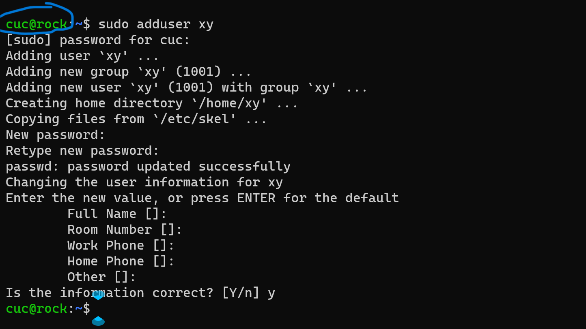
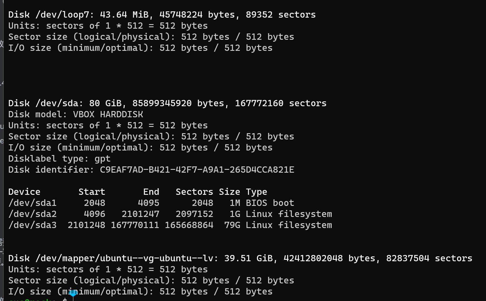
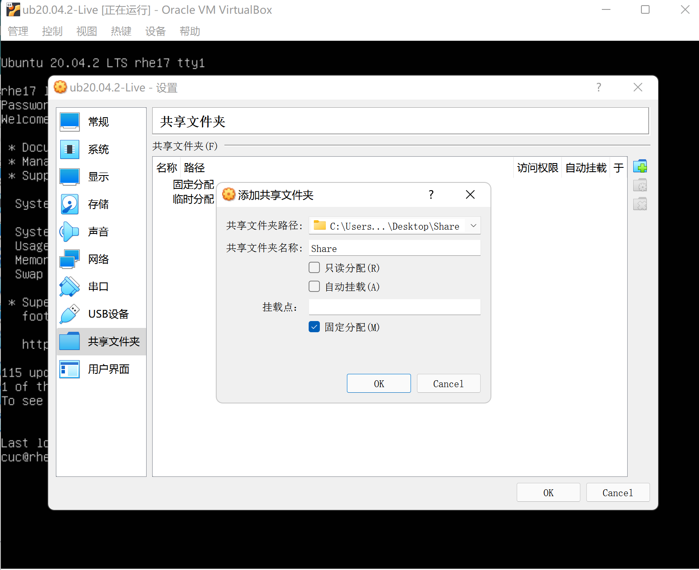
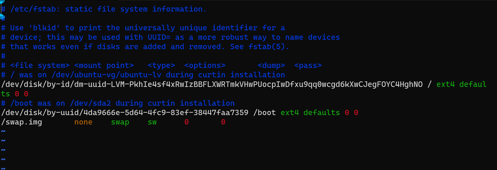
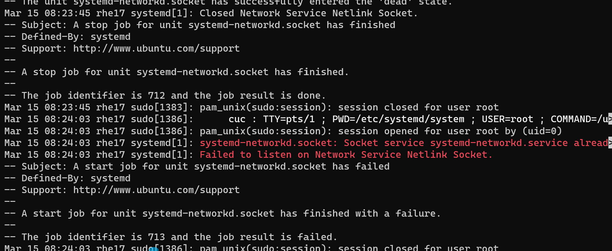

# Linux网络与系统管理实验（三）Systemd 入门教程

------

## 实验环境

- **VirtualBox 6.1**
- **Ubuntu 20.04.02 Server 64bit**

------

## 实验内容

- ### 根据[Systemd 入门教程：命令篇](http://www.ruanyifeng.com/blog/2016/03/systemd-tutorial-commands.html)完成相关Systemd基本操作

- ### 根据[Systemd 入门教程：实战篇](http://www.ruanyifeng.com/blog/2016/03/systemd-tutorial-part-two.html)完成相关操作

- ### 自查清单

------

## 一、根据[Systemd 入门教程：命令篇](http://www.ruanyifeng.com/blog/2016/03/systemd-tutorial-commands.html)完成相关Systemd基本操作

### 3.2 systemd-analyze

```shell
# 查看启动耗时
$ systemd-analyze                                                                                   
# 查看每个服务的启动耗时
$ systemd-analyze blame
# 显示瀑布状的启动过程流
$ systemd-analyze critical-chain
# 显示指定服务的启动流
$ systemd-analyze critical-chain atd.service
```

[](https://asciinema.org/a/p9wcoHW4ENkwEkbJoB7ZNvggQ)

### 3.3 hostnamectl——3.4 localectl

```shell
# 显示当前主机的信息
$ hostnamectl
# 设置主机名。
$ sudo hostnamectl set-hostname rhel7
# 查看本地化设置
$ localectl
# 设置本地化参数。
$ sudo localectl set-locale LANG=en_GB.utf8
$ sudo localectl set-keymap en_GB
```

[](https://asciinema.org/a/j2orB2L2mIEQAYq3eBl0WDsvY)

### 3.5 timedatectl

```shell
# 查看当前时区设置
$ timedatectl
# 显示所有可用的时区
$ timedatectl list-timezones                                                                       
# 设置当前时区
$ sudo timedatectl set-timezone America/New_York
$ sudo timedatectl set-time YYYY-MM-DD
$ sudo timedatectl set-time HH:MM:SS
```

[](https://asciinema.org/a/q0czCWQCqcL3Nn1D3BGsVs4Ei)

### 3.6 loginctl

```shell
# 列出当前session
$ loginctl list-sessions
# 列出当前登录用户
$ loginctl list-users
# 列出显示指定用户的信息
$ loginctl show-user ruanyf
```

[](https://asciinema.org/a/CyrWF9FoYpfbTKt1t2EP1ylAW)

### 4.1 Unit - 4.2 Unit status

```shell
# 列出正在运行的 Unit
$ systemctl list-units
# 列出所有Unit，包括没有找到配置文件的或者启动失败的
$ systemctl list-units --all
# 列出所有没有运行的 Unit
$ systemctl list-units --all --state=inactive
# 列出所有加载失败的 Unit
$ systemctl list-units --failed
# 列出所有正在运行的、类型为 service 的 Unit
$ systemctl list-units --type=service
# 显示系统状态
$ systemctl status
# 显示单个 Unit 的状态
$ sysystemctl status bluetooth.service
# 显示远程主机的某个 Unit 的状态
$ systemctl -H root@rhel7.example.com status httpd.service
# 显示某个 Unit 是否正在运行
$ systemctl is-active application.service
# 显示某个 Unit 是否处于启动失败状态
$ systemctl is-failed application.service
# 显示某个 Unit 服务是否建立了启动链接
$ systemctl is-enabled application.service
```

[](https://asciinema.org/a/q07KGo3wbnKX0OEema52M9og5)

### 4.3 Unit管理 - 4.4 dependencies

```shell
# 立即启动一个服务
$ sudo systemctl start apache.service
# 立即停止一个服务
$ sudo systemctl stop apache.service
# 重启一个服务
$ sudo systemctl restart apache.service
# 杀死一个服务的所有子进程
$ sudo systemctl kill apache.service
# 重新加载一个服务的配置文件
$ sudo systemctl reload apache.service
# 重载所有修改过的配置文件
$ sudo systemctl daemon-reload
# 显示某个 Unit 的所有底层参数
$ systemctl show httpd.service
# 显示某个 Unit 的指定属性的值
$ systemctl show -p CPUShares httpd.service
# 设置某个 Unit 的指定属性
$ sudo systemctl set-property httpd.service CPUShares=500
$ systemctl list-dependencies nginx.service #systemctl list-dependencies命令列出一个 Unit 的所有依赖。
$ systemctl list-dependencies --all nginx.service # 有些依赖是 Target 类型（详见下文），默认不会展开显示。如果要展开 Target，就需要使用--all参数。
```

[](https://asciinema.org/a/nuSUXECV7qAc7yRqCSxC3EyJ9)

### 5 Unit配置文件

### 5.1 概述

每一个 Unit 都有一个配置文件，告诉 Systemd 怎么启动这个 Unit 。

Systemd 默认从目录`/etc/systemd/system/`读取配置文件。但是，里面存放的大部分文件都是符号链接，指向目录`/usr/lib/systemd/system/`，真正的配置文件存放在那个目录。

`systemctl enable`命令用于在上面两个目录之间，建立符号链接关系。

> ```bash
> $ sudo systemctl enable clamd@scan.service
> # 等同于
> $ sudo ln -s '/usr/lib/systemd/system/clamd@scan.service' '/etc/systemd/system/multi-user.target.wants/clamd@scan.service'
> ```

如果配置文件里面设置了开机启动，`systemctl enable`命令相当于激活开机启动。

与之对应的，`systemctl disable`命令用于在两个目录之间，撤销符号链接关系，相当于撤销开机启动。

> ```bash
> $ sudo systemctl disable clamd@scan.service
> ```

配置文件的后缀名，就是该 Unit 的种类，比如`sshd.socket`。如果省略，Systemd 默认后缀名为`.service`，所以`sshd`会被理解成`sshd.service`。

### 5.2 配置文件的状态

`systemctl list-unit-files`命令用于列出所有配置文件。

> ```bash
> # 列出所有配置文件
> $ systemctl list-unit-files
> 
> # 列出指定类型的配置文件
> $ systemctl list-unit-files --type=service
> ```

这个命令会输出一个列表。

> ```bash
> $ systemctl list-unit-files
> 
> UNIT FILE              STATE
> chronyd.service        enabled
> clamd@.service         static
> clamd@scan.service     disabled
> ```

这个列表显示每个配置文件的状态，一共有四种。

> - enabled：已建立启动链接
> - disabled：没建立启动链接
> - static：该配置文件没有`[Install]`部分（无法执行），只能作为其他配置文件的依赖
> - masked：该配置文件被禁止建立启动链接

注意，从配置文件的状态无法看出，该 Unit 是否正在运行。这必须执行前面提到的`systemctl status`命令。

> ```bash
> $ systemctl status bluetooth.service
> ```

一旦修改配置文件，就要让 SystemD 重新加载配置文件，然后重新启动，否则修改不会生效。

> ```bash
> $ sudo systemctl daemon-reload
> $ sudo systemctl restart httpd.service
> ```

### 5.3 配置文件的格式

配置文件就是普通的文本文件，可以用文本编辑器打开。

`systemctl cat`命令可以查看配置文件的内容。

> ```bash
> $ systemctl cat atd.service
> 
> [Unit]
> Description=ATD daemon
> 
> [Service]
> Type=forking
> ExecStart=/usr/bin/atd
> 
> [Install]
> WantedBy=multi-user.target
> ```

从上面的输出可以看到，配置文件分成几个区块。每个区块的第一行，是用方括号表示的区别名，比如`[Unit]`。注意，配置文件的区块名和字段名，都是大小写敏感的。

每个区块内部是一些等号连接的键值对。

> ```bash
> [Section]
> Directive1=value
> Directive2=value
> 
> . . .
> ```

注意，键值对的等号两侧不能有空格。

### 5.4 配置文件的区块

`[Unit]`区块通常是配置文件的第一个区块，用来定义 Unit 的元数据，以及配置与其他 Unit 的关系。它的主要字段如下。

> - `Description`：简短描述
> - `Documentation`：文档地址
> - `Requires`：当前 Unit 依赖的其他 Unit，如果它们没有运行，当前 Unit 会启动失败
> - `Wants`：与当前 Unit 配合的其他 Unit，如果它们没有运行，当前 Unit 不会启动失败
> - `BindsTo`：与`Requires`类似，它指定的 Unit 如果退出，会导致当前 Unit 停止运行
> - `Before`：如果该字段指定的 Unit 也要启动，那么必须在当前 Unit 之后启动
> - `After`：如果该字段指定的 Unit 也要启动，那么必须在当前 Unit 之前启动
> - `Conflicts`：这里指定的 Unit 不能与当前 Unit 同时运行
> - `Condition...`：当前 Unit 运行必须满足的条件，否则不会运行
> - `Assert...`：当前 Unit 运行必须满足的条件，否则会报启动失败

`[Install]`通常是配置文件的最后一个区块，用来定义如何启动，以及是否开机启动。它的主要字段如下。

> - `WantedBy`：它的值是一个或多个 Target，当前 Unit 激活时（enable）符号链接会放入`/etc/systemd/system`目录下面以 Target 名 + `.wants`后缀构成的子目录中
> - `RequiredBy`：它的值是一个或多个 Target，当前 Unit 激活时，符号链接会放入`/etc/systemd/system`目录下面以 Target 名 + `.required`后缀构成的子目录中
> - `Alias`：当前 Unit 可用于启动的别名
> - `Also`：当前 Unit 激活（enable）时，会被同时激活的其他 Unit

`[Service]`区块用来 Service 的配置，只有 Service 类型的 Unit 才有这个区块。它的主要字段如下。

> - `Type`：定义启动时的进程行为。它有以下几种值。
> - `Type=simple`：默认值，执行`ExecStart`指定的命令，启动主进程
> - `Type=forking`：以 fork 方式从父进程创建子进程，创建后父进程会立即退出
> - `Type=oneshot`：一次性进程，Systemd 会等当前服务退出，再继续往下执行
> - `Type=dbus`：当前服务通过D-Bus启动
> - `Type=notify`：当前服务启动完毕，会通知`Systemd`，再继续往下执行
> - `Type=idle`：若有其他任务执行完毕，当前服务才会运行
> - `ExecStart`：启动当前服务的命令
> - `ExecStartPre`：启动当前服务之前执行的命令
> - `ExecStartPost`：启动当前服务之后执行的命令
> - `ExecReload`：重启当前服务时执行的命令
> - `ExecStop`：停止当前服务时执行的命令
> - `ExecStopPost`：停止当其服务之后执行的命令
> - `RestartSec`：自动重启当前服务间隔的秒数
> - `Restart`：定义何种情况 Systemd 会自动重启当前服务，可能的值包括`always`（总是重启）、`on-success`、`on-failure`、`on-abnormal`、`on-abort`、`on-watchdog`
> - `TimeoutSec`：定义 Systemd 停止当前服务之前等待的秒数
> - `Environment`：指定环境变量

Unit 配置文件的完整字段清单，请参考[官方文档](https://www.freedesktop.org/software/systemd/man/systemd.unit.html)。

[](https://asciinema.org/a/hrEtSeFojcNvNGAsshEbtwqhS)

### 6 Target 

启动计算机的时候，需要启动大量的 Unit。如果每一次启动，都要一一写明本次启动需要哪些 Unit，显然非常不方便。Systemd 的解决方案就是 Target。

简单说，Target 就是一个 Unit 组，包含许多相关的 Unit 。启动某个 Target 的时候，Systemd 就会启动里面所有的 Unit。从这个意义上说，Target 这个概念类似于"状态点"，启动某个 Target 就好比启动到某种状态。

传统的`init`启动模式里面，有 RunLevel 的概念，跟 Target 的作用很类似。不同的是，RunLevel 是互斥的，不可能多个 RunLevel 同时启动，但是多个 Target 可以同时启动。

> ```bash
> # 查看当前系统的所有 Target
> $ systemctl list-unit-files --type=target
> 
> # 查看一个 Target 包含的所有 Unit
> $ systemctl list-dependencies multi-user.target
> 
> # 查看启动时的默认 Target
> $ systemctl get-default
> 
> # 设置启动时的默认 Target
> $ sudo systemctl set-default multi-user.target
> 
> # 切换 Target 时，默认不关闭前一个 Target 启动的进程，
> # systemctl isolate 命令改变这种行为，
> # 关闭前一个 Target 里面所有不属于后一个 Target 的进程
> $ sudo systemctl isolate multi-user.target
> ```

Target 与 传统 RunLevel 的对应关系如下。

> ```bash
> Traditional runlevel      New target name     Symbolically linked to...
> 
> Runlevel 0           |    runlevel0.target -> poweroff.target
> Runlevel 1           |    runlevel1.target -> rescue.target
> Runlevel 2           |    runlevel2.target -> multi-user.target
> Runlevel 3           |    runlevel3.target -> multi-user.target
> Runlevel 4           |    runlevel4.target -> multi-user.target
> Runlevel 5           |    runlevel5.target -> graphical.target
> Runlevel 6           |    runlevel6.target -> reboot.target
> ```

它与`init`进程的主要差别如下。

> **（1）默认的 RunLevel**（在`/etc/inittab`文件设置）现在被默认的 Target 取代，位置是`/etc/systemd/system/default.target`，通常符号链接到`graphical.target`（图形界面）或者`multi-user.target`（多用户命令行）。
>
> **（2）启动脚本的位置**，以前是`/etc/init.d`目录，符号链接到不同的 RunLevel 目录 （比如`/etc/rc3.d`、`/etc/rc5.d`等），现在则存放在`/lib/systemd/system`和`/etc/systemd/system`目录。
>
> **（3）配置文件的位置**，以前`init`进程的配置文件是`/etc/inittab`，各种服务的配置文件存放在`/etc/sysconfig`目录。现在的配置文件主要存放在`/lib/systemd`目录，在`/etc/systemd`目录里面的修改可以覆盖原始设置。

[](https://asciinema.org/a/gLj7tlZpkHcXW1gEzVVzHK108)

### **7 日志管理**

Systemd 统一管理所有 Unit 的启动日志。带来的好处就是，可以只用`journalctl`一个命令，查看所有日志（内核日志和应用日志）。日志的配置文件是`/etc/systemd/journald.conf`。

`journalctl`功能强大，用法非常多。

> ```bash
> # 查看所有日志（默认情况下 ，只保存本次启动的日志）
> $ sudo journalctl
> 
> # 查看内核日志（不显示应用日志）
> $ sudo journalctl -k
> 
> # 查看系统本次启动的日志
> $ sudo journalctl -b
> $ sudo journalctl -b -0
> 
> # 查看上一次启动的日志（需更改设置）
> $ sudo journalctl -b -1
> 
> # 查看指定时间的日志
> $ sudo journalctl --since="2012-10-30 18:17:16"
> $ sudo journalctl --since "20 min ago"
> $ sudo journalctl --since yesterday
> $ sudo journalctl --since "2015-01-10" --until "2015-01-11 03:00"
> $ sudo journalctl --since 09:00 --until "1 hour ago"
> 
> # 显示尾部的最新10行日志
> $ sudo journalctl -n
> 
> # 显示尾部指定行数的日志
> $ sudo journalctl -n 20
> 
> # 实时滚动显示最新日志
> $ sudo journalctl -f
> 
> # 查看指定服务的日志
> $ sudo journalctl /usr/lib/systemd/systemd
> 
> # 查看指定进程的日志
> $ sudo journalctl _PID=1
> 
> # 查看某个路径的脚本的日志
> $ sudo journalctl /usr/bin/bash
> 
> # 查看指定用户的日志
> $ sudo journalctl _UID=33 --since today
> 
> # 查看某个 Unit 的日志
> $ sudo journalctl -u nginx.service
> $ sudo journalctl -u nginx.service --since today
> 
> # 实时滚动显示某个 Unit 的最新日志
> $ sudo journalctl -u nginx.service -f
> 
> # 合并显示多个 Unit 的日志
> $ journalctl -u nginx.service -u php-fpm.service --since today
> 
> # 查看指定优先级（及其以上级别）的日志，共有8级
> # 0: emerg
> # 1: alert
> # 2: crit
> # 3: err
> # 4: warning
> # 5: notice
> # 6: info
> # 7: debug
> $ sudo journalctl -p err -b
> 
> # 日志默认分页输出，--no-pager 改为正常的标准输出
> $ sudo journalctl --no-pager
> 
> # 以 JSON 格式（单行）输出
> $ sudo journalctl -b -u nginx.service -o json
> 
> # 以 JSON 格式（多行）输出，可读性更好
> $ sudo journalctl -b -u nginx.serviceqq
>  -o json-pretty
> 
> # 显示日志占据的硬盘空间
> $ sudo journalctl --disk-usage
> 
> # 指定日志文件占据的最大空间
> $ sudo journalctl --vacuum-size=1G
> 
> # 指定日志文件保存多久
> $ sudo journalctl --vacuum-time=1years
> ```

[](https://asciinema.org/a/97CYOetoslBfnK3XbHJa46RnH)

## 二、根据[Systemd 入门教程：实战篇](http://www.ruanyifeng.com/blog/2016/03/systemd-tutorial-part-two.html)完成相关操作

------

#### 	操作过程：

[](https://asciinema.org/a/1QCJFFNw4Du49vBGRf9v7QnVL)


## 三、自查清单

------

#### **1.如何添加一个用户并使其具备sudo执行程序的权限**

- **先用adduser命令创建用户，然后把新建的用户加入到sudo组里面,就可以看到新建用户在sudo组里面了**

- ```shell
  sudo adduser xy
  sudo usermod -G sudo -a xy
  ```

  

#### **2.如何将一个用户添加到一个用户组**

```shell
usermod -a -G <groupname> <username>
```

#### **3.如何查看当前系统的分区表和文件系统详细信息**

```shell
#查看分区表
sudo fdisk -l 
#以更易读的方式显示目前磁盘空间和使用情况   
df -h  
```



#### **4.如何实现开机自动挂载Virtualbox的共享目录分区**

- 先在宿主机创建一个共享文件夹，此处已创建名为“Share”的文件夹，并在VirtualBox完成设置

  

- ​	在虚拟机的`/mnt`目录下新建一个共享文件的挂载目录，到时外部的驱动器根目录就直接挂载到这个目录下。我这里将其命名为`Share`

  ```shell
   cd /mnt/ #进入当前文件夹
   sudo mkdir share #创建共享文件夹
   mount -t vboxsf sharing /mnt/share # 在 /etc/rc.local 中用root用户执行命令
  ```

- 执行挂载命令 `sudo mount -t vboxsf [Windows共享文件夹名称] /mnt/dirname`

- 修改 /etc/fstab 文件 在文末添加`[Windows共享文件夹名称] /mnt/dirname/ vboxsf defaults 0 0`即可完成开机自动挂载

  

#### **5.基于LVM的分区如何实现动态扩容和缩减容量**

```shell
lvextend -L +<容量> <目录>    #扩容
lvreduce -L -<容量> <目录>    #减容
```

#### **6.如何通过Systemd设置实现在网络连通时运行一个指定脚本，在网络断开时运行另一个脚本**

- 直接在`systemd-networkd.service`修改文件配置即可

  [](https://asciinema.org/a/JJlHDkhgwA4wRvz5m5gqdjFGg)

- 最后在日志文件中查看内容

  

#### **7.如何通过systemd设置实现一个脚本在任何情况下被杀死之后会立即重新启动，实现杀不死**

- 修改配置文件[service]区块，将**restart**设置为**always**

- ```
  [Service]
  Restart = always
  ```

- 然后重新加载配置文件`sudo systemctl daemon-reload`

- 重新启动服务`sudo systemctl restart ××××`

## 过程中遇到的问题

------

- 在完成自动挂载的过程中出现`mount: /mnt/xxx: wrong fs type, bad option, bad superblock on xxx...` 

  解决方法：`sudo apt-get install virtualbox-guest-utils`

- 在使用自动挂载的文件夹在虚拟机系统无法找到

  解决方法：需要在根目录下进行查找

- 在解决如何将一个用户添加到一个用户组的过程中对于如何操作代码有疑问

  解决方法：查阅相关文档，了解到chomd这种语句的具体相关用法

- 在使用LVM分区进行动态扩容过程中没有把挂载的分区删除导致出现错误

  解决方法：删除挂载分区，重新进行分区扩容分配
  
- 在自查清单中完成将一个用户添加到一个用户组时，刚开始由于没有输入正确的用户组出现了错误。查阅了相关资料后，执行`cat /etc/passwd`命令，查看用户组，并选择了lp用户组完成本题。之后执行`usermod -a -G lp guest`命令后出现usermod: cannot lock /etc/passwd; try again later报错。

  解决方法：在网上查阅了相关资料后，将命令更改为`sudo -- usermod –G groupname username`，这样就解决了将用户加入到用户组时报标题的错，成功加入之后，需要重新接连服务器，该user就拥有了该group的权限，问题得以解决。

- 在执行脚本的过程中遇到了对于脚本运行和编写的知识空缺

  解决方法：

  - 首先在指定目录下使用 `cat`命令创建一个名为 `xxx.sh`的脚本文件

  - 然后在终端中键入你想要的文本内容或命令语句 例：

    ```shell
    $ echo 'hello world!'
    或
    #!/bin/sh
    
    $ touch /home/cuc/script/StopTest.txt
    ```

- 然后直接通过`bash xxx.sh`来执行编写的脚本即可。

- **问题**：执行修改时区时报错

  ```shell
  Failed to parse time specification 'YYYY-MM-DD': Invalid argument
  ```

- **解决方法**： 先关闭时间同步

  ```shell
  timedatectl set-ntp no
  ```

- 然后执行

  ```shell
  sudo timedatectl set-time 2021-3-31
  ```

- 再开启时间同步

  ```shell
  timedatectl set-ntp yes
  ```

- 修改成功

## 参考资料

------

[The method of automatically mounting the shared directory for Ubuntu 20.04 boot under Virtualbox](https://blog.csdn.net/jiangdan_lili/article/details/110003759)

[Systemd 入门教程：命令篇](http://www.ruanyifeng.com/blog/2016/03/systemd-tutorial-commands.html)

[Systemd 入门教程：实战篇](http://www.ruanyifeng.com/blog/2016/03/systemd-tutorial-part-two.html)

[systemd.service 中文手册](http://www.jinbuguo.com/systemd/systemd.service.html)

[Using LVM to realize dynamic partition expansion in Linux](https://blog.csdn.net/seteor/article/details/6708025)

[Systemd Service Management Tutorial](https://cloud.tencent.com/developer/article/1516125)

[Linux read partition table file, Linux disk partition table, file system view and operation](https://blog.csdn.net/weixin_34502439/article/details/116693398)

[Fixing a systemd service 203/EXEC failure (no such file or directory)](https://devpeace.com/bash/45776003/fixing-a-systemd-service-203-exec-failure-no-such-file-or-directory)

[Configure a simple auto-restart service with systemd](https://blog.csdn.net/weixin_34261415/article/details/89053213?spm=1001.2101.3001.6650.1&utm_medium=distribute.pc_relevant.none-task-blog-2~default~CTRLIST~Rate-1.pc_relevant_antiscanv2&depth_1-utm_source=distribute.pc_relevant.none-task-blog-2~default~CTRLIST~Rate-1.pc_relevant_antiscanv2&utm_relevant_index=2)

