# Linux网络与系统管理实验（五）Web服务器（实验）

------

## 实验环境

- Ubuntu 20.04 Server
- 软件环境
  - Nginx
  - VeryNginx
  - WordCompress 4.7

## 实验内容

**1、基本要求** 

- 在一台主机（虚拟机）上同时配置Nginx和VeryNginx
- VeryNginx作为本次实验的Web App的反向代理服务器和WAF
- PHP-FPM进程的反向代理配置在nginx服务器上，VeryNginx服务器不直接配置Web站点服务
- 使用Wordpress搭建的站点对外提供访问的地址为： [http://wp.sec.cuc.edu.cn](http://wp.sec.cuc.edu.cn/)
- 使用Damn Vulnerable Web Application (DVWA)搭建的站点对外提供访问的地址为： [http://dvwa.sec.cuc.edu.cn](http://dvwa.sec.cuc.edu.cn/)

**2、安全加固要求**

- 使用IP地址方式均无法访问上述任意站点，并向访客展示自定义的友好错误提示信息页面-1
- Damn Vulnerable Web Application (DVWA)只允许白名单上的访客来源IP，其他来源的IP访问均向访客展示自定义的友好错误提示信息页面-2
- 在不升级Wordpress版本的情况下，通过定制VeryNginx的访问控制策略规则，热修复WordPress < 4.7.1 - Username Enumeration
- 通过配置VeryNginx的Filter规则实现对Damn Vulnerable Web Application (DVWA)的SQL注入实验在低安全等级条件下进行防护

**2、VeryNginx配置要求**

- VeryNginx的Web管理页面仅允许白名单上的访客来源IP，其他来源的IP访问均向访客展示自定义的友好错误提示信息页面-3
- 通过定制VeryNginx的访问控制策略规则实现：
  - 限制DVWA站点的单IP访问速率为每秒请求数 < 50
  - 限制Wordpress站点的单IP访问速率为每秒请求数 < 20
  - 超过访问频率限制的请求直接返回自定义错误提示信息页面-4
  - 禁止curl访问

## 实验过程

### 一、环境搭建

#### 更改主机hosts文件

```shell
# nginx
192.168.56.102 vn.sec.cuc.edu.cn
192.168.56.102 dvwa.sec.cuc.edu.cn
192.168.56.102 wp.sec.cuc.edu.cn
```

#### 安装配置Verynginx、Nginx、Wordpress、DVWA

**php及相关组件**

```shell
sudo apt install php-fpm php-mysql php-curl php-gd php-intl php-mbstring php-soap php-xml php-xmlrpc php-zip
```

**VeryNginx**

```shell
# 克隆VeryNginx仓库
git clone https://github.com/alexazhou/VeryNginx.git
cd VeryNginx
# python3
sudo python3 install.py install
```

- 安装python3前对缺失的库补充安装

```shell
# zlib
sudo apt-get install zlib1g-dev
# pcre
sudo apt-get update 
sudo apt-get install libpcre3 libpcre3-dev
# gcc 
sudo apt install gcc
# make
sudo apt install make
# penssl library
sudo apt install libssl-dev
```

- 配置

```shell
# 修改 `/opt/verynginx/openresty/nginx/conf/nginx.conf` 配置文件
sudo vim /opt/verynginx/openresty/nginx/conf/nginx.conf

#修改以下部分：

# 用户名
user  www-data;

# 监听端口
# 为了不和其他端口冲突，此处设置为8081
server {
        listen 192.168.56.102:8081;
        
        #this line shoud be include in every server block
        include /opt/verynginx/verynginx/nginx_conf/in_server_block.conf;

        location = / {
            root   html;
            index  index.html index.htm;
        }
    }
```

- 添加进程权限

```shell
chmod -R 777 /opt/verynginx/verynginx/configs
```

- 访问服务器的8081端口，安装成功


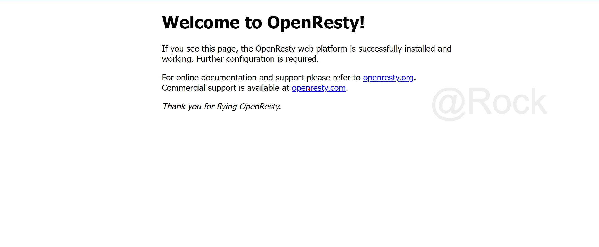

- 默认的用户名和密码`verynginx`/`verynginx` 进入`verynginx/index.html`
- 登陆成功

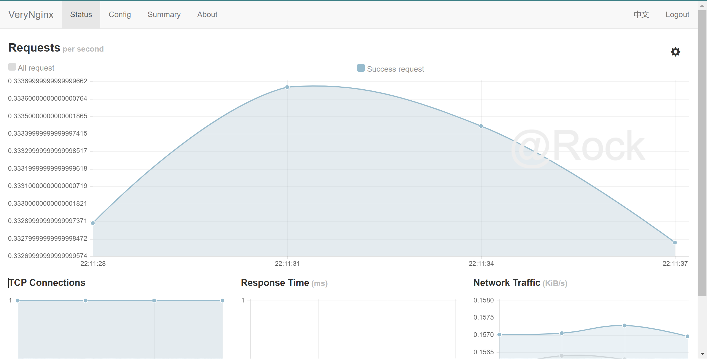

**Nginx**

- 安装

```shell
sudo apt install nginx
```

- 进入nginx目录

```shell
sudo vim /etc/nginx/sites-enabled/default
```

*部分配置文件*

```shell
root /var/www/html/wp.sec.cuc.edu.cn;

  # Add index.php to the list if you are using PHP
  index readme.html index.php;

location ~ \.php$ {
	#	include snippets/fastcgi-php.conf;
	#
	#	# With php-fpm (or other unix sockets):
		fastcgi_pass unix:/var/run/php/php7.4-fpm.sock;
		fastcgi_index index.php;
		fastcgi_param SCRIPT_FILENAME $document_root$fastcgi_script_name;
		include fastcgi_params;
	#	# With php-cgi (or other tcp sockets):
#		fastcgi_pass 127.0.0.1:9000;
	}
```

**WordPress**

- 安装与配置

```shell
# 下载安装包
sudo wget https://wordpress.org/wordpress-4.7.zip

# 解压
sudo apt install p7zip-full
7z x wordpress-4.7.zip

# 将解压后的wordpress移至指定路径
sudo mkdir /var/www/html/wp.sec.cuc.edu.cn
sudo cp wordpress /var/www/html/wp.sec.cuc.edu.cn

# 修改wp-config-sample中的内容，并更名为wp-config
sudo vim wp-config-sample
mv wp-config-sample wp-config
```

- 补充数据库信息

```shell
# 登录
sudo mysql
# 建库
CREATE DATABASE wordpress DEFAULT CHARACTER SET utf8 COLLATE utf8_unicode_ci;
# 新建用户
create user 'rock'@'localhost' identified by 'XuYan$123456';
# 授权
grant all on wordpress.* to 'rock'@'localhost';
```

- 修改配置文件

```shell
// ** MySQL settings - You can get this info from your web host ** //
/** The name of the database for WordPress */
define('DB_NAME', 'wordpress');

/** MySQL database username */
define('DB_USER', 'username');

/** MySQL database password */
define('DB_PASSWORD', 'password');

/** MySQL hostname */
define('DB_HOST', 'localhost');

/** Database Charset to use in creating database tables. */
define('DB_CHARSET', 'utf8');

/** The Database Collate type. Don't change this if in doubt. */
define('DB_COLLATE', '');
```

- 进入wordpress

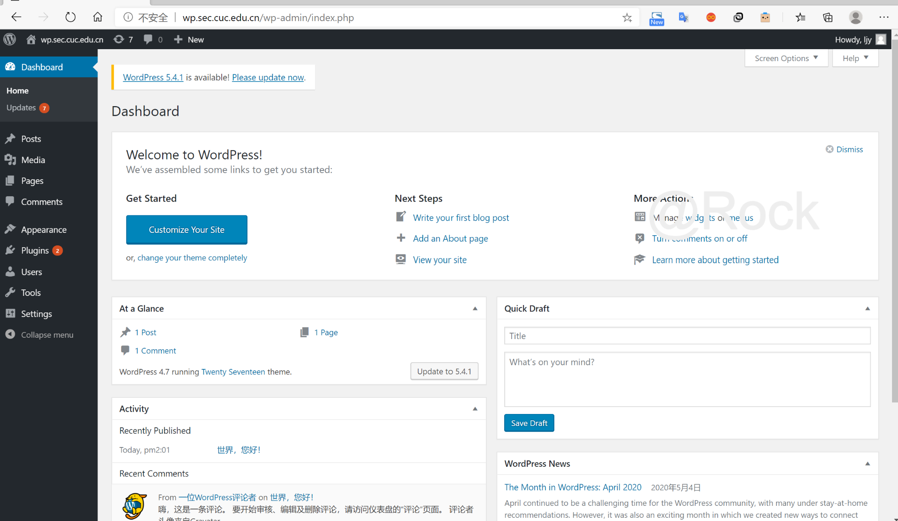

**DVWA**

- 安装

```shell
# 下载
git clone https://github.com/digininja/DVWA.git
# 建立目录
sudo mkdir /var/www/html/dvwa.sec.cuc.edu.cn
# 移动文件夹内容至该目录下
sudo mv DVWA/* /var/www/html/dvwa.sec.cuc.edu.cn
```

- 配置MySQL

```shell
sudo mysql
CREATE DATABASE dvwa DEFAULT CHARACTER SET utf8 COLLATE utf8_unicode_ci;
CREATE USER 'dvwa'@'localhost' IDENTIFIED BY 'p@ssw0rd';
GRANT ALL ON dvwa.* TO 'dvwa'@'localhost';
exit
```

- 配置PHP

```shell
sudo mv config.inc.php.dist config.inc.php

# 默认配置：
$_DVWA[ 'db_database' ] = 'dvwa';
$_DVWA[ 'db_user' ] = 'dvwa';
$_DVWA[ 'db_password' ] = 'p@ssw0rd';

# 修改php-fpm文件
sudo vim /etc/php/7.4/fpm/php.ini 

display_errors: Off
safe_mode: Off
allow_url_include: On
allow_url_fopen: On

#重启php
systemctl restart php7.4-fpm.service

#授权给www-data用户和组
sudo chown -R www-data.www-data /var/www/html/dvwa.sec.cuc.edu.cn
```

- 配置服务器块文件

```shell
sudo vim /etc/nginx/sites-available/dvwa.sec.cuc.edu.cn

# 写入配置文件
server {
    listen 8080 default_server;
    listen [::]:8080 default_server;

    root /var/www/html/dvwa.sec.cuc.edu.cn;
    index index.php index.html index.htm index.nginx-debian.html;
    server_name dvwa.sec.cuc.edu.cn;

    location / {
        #try_files $uri $uri/ =404;
        try_files $uri $uri/ /index.php$is_args$args;  
    }

    location ~ \.php$ {
        include snippets/fastcgi-php.conf;
        fastcgi_pass unix:/var/run/php/php7.4-fpm.sock;
    }

    location ~ /\.ht {
        deny all;
    }
}

# 创建软链接
sudo ln -s /etc/nginx/sites-available/dvwa.sec.cuc.edu.cn /etc/nginx/sites-enabled/

# 检查并重启服务
sudo nginx -t
systemctl restart nginx.service
```

- 成功访问dvwa


### 二、实验过程

#### 使用VeryNginx反向代理Wordpress,DVWA

- Matcher

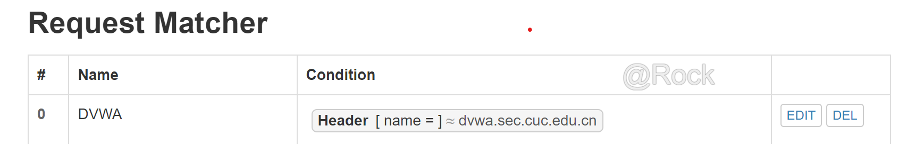

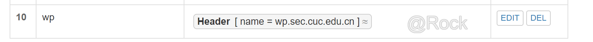

- Up Stream

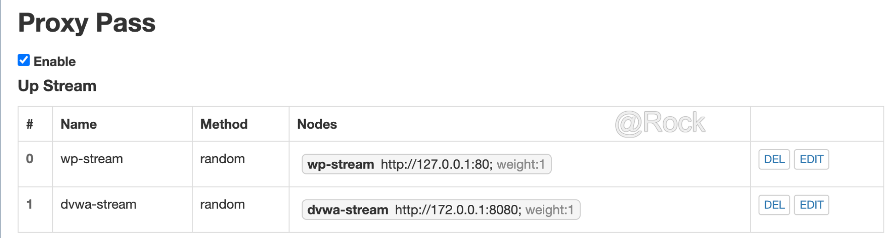

- Proxy Pass

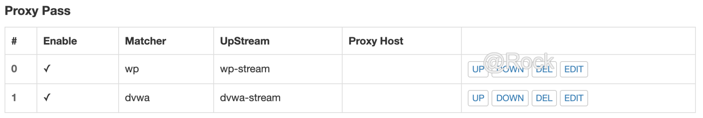

#### 安全加固要求

##### 使用IP地址方式均无法访问上述任意站点，并向访客展示自定义的友好错误提示信息页面-1

- Matcher

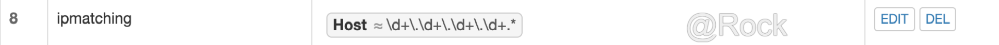

- Response

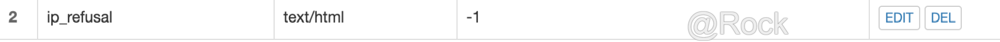

- Filter

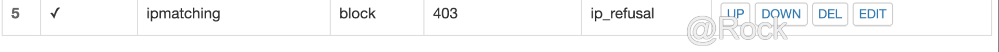

- 结果


##### Damn Vulnerable Web Application (DVWA)只允许白名单上的访客来源IP，其他来源的IP访问均向访客展示自定义的友好错误提示信息页面-2

- Matcher

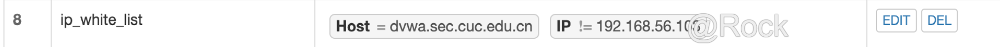

- Response

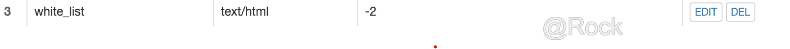

- Filter

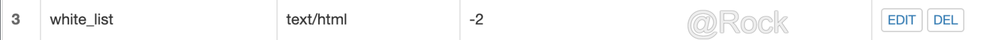

- 结果

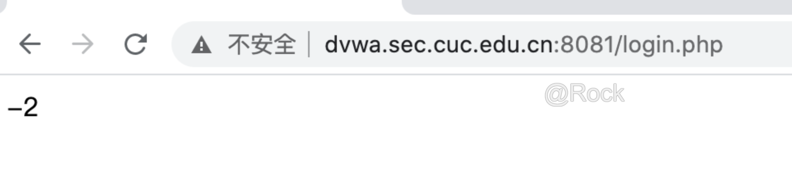

##### 在不升级Wordpress版本的情况下，通过定制VeryNginx的访问控制策略规则，热修复[WordPress < 4.7.1 - Username Enumeration](https://www.exploit-db.com/exploits/41497/)

- 漏洞载入

  - 拷贝漏洞文本到Linux主机，修改相应文本

    ```shell
    $url = "http://wp.sec.cuc.edu.cn/";
    ```

  - 安装依赖包

    ```shell
    idchannov@id-srv:~$ sudo apt install php7.2-cli
    ```

  - 执行脚本

    ```shell
    idchannov@id-srv:~$ php err.php
    ```

  - 制定安全策略

    - 在**Basic**中添加匹配规则

      

    - 在**Custom Action**中添加过滤条件

      

- 通过配置VeryNginx的Filter规则实现对Damn Vulnerable Web Application (DVWA)的SQL注入实验在低安全等级条件下进行防护

  - 在**Basic**中添加匹配规则

    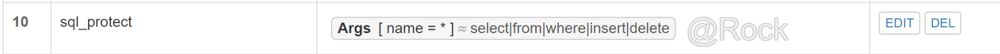

  - 在**Custom Action**中添加过滤条件

    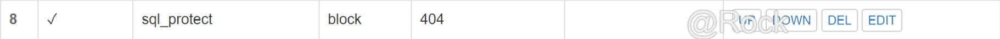

##### 通过配置VeryNginx的Filter规则实现对Damn Vulnerable Web Application (DVWA)的SQL注入实验在低安全等级条件下进行防护

- 将security level修改为low

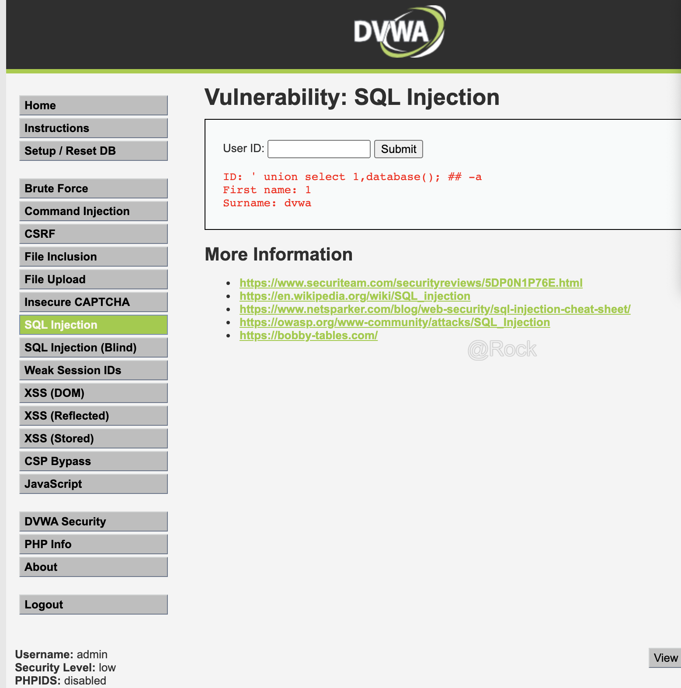

- Matcher

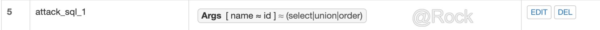

- Filter

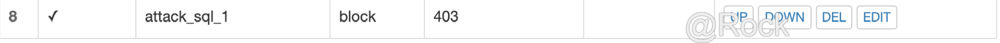

- 结果

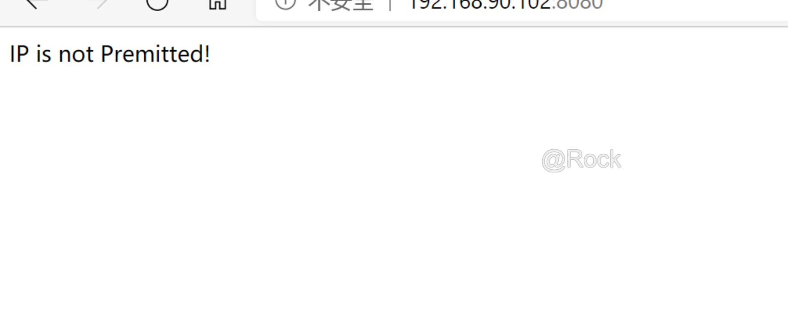

#### VeryNginx配置要求

##### VeryNginx的Web管理页面仅允许白名单上的访客来源IP，其他来源的IP访问均向访客展示自定义的友好错误提示信息页面-3

- 在**Basic**中添加匹配规则

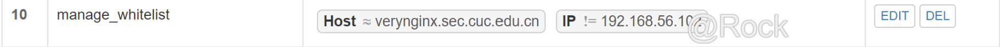

- 在**Basic**中添加**友好错误提示信息页面-3**的响应信息

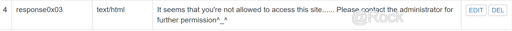

- 在**Custom Action**中添加过滤条件

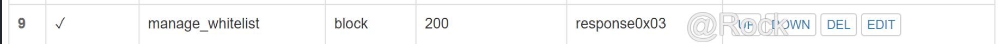

- 结果

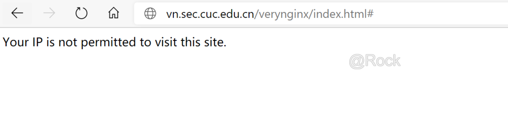

##### 通过定制VeryNginx的访问控制策略规则实现：

- 限制DVWA站点的单IP访问速率为每秒请求数 < 50

- 限制Wordpress站点的单IP访问速率为每秒请求数 < 20

- 超过访问频率限制的请求直接返回自定义**错误提示信息页面-4**

  - 设置自定义response

  - 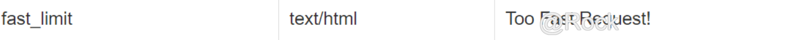

  - 设置频率限制Frequency Limit
  - 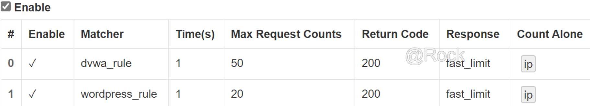

  - 结果 
  - 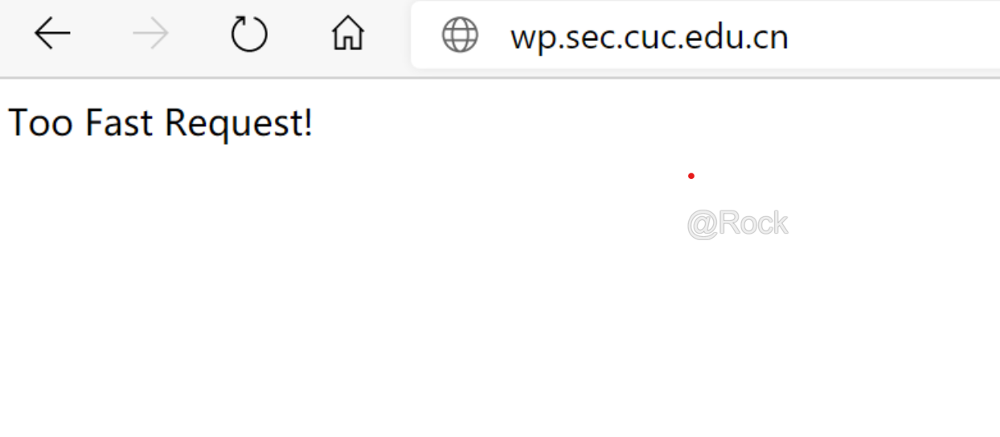

- 禁止curl访问

  - 添加matcher
  - 

  - 添加filter
  - 

  - 结果 
  
  - 

## 过程中遇到的问题


## 参考资料